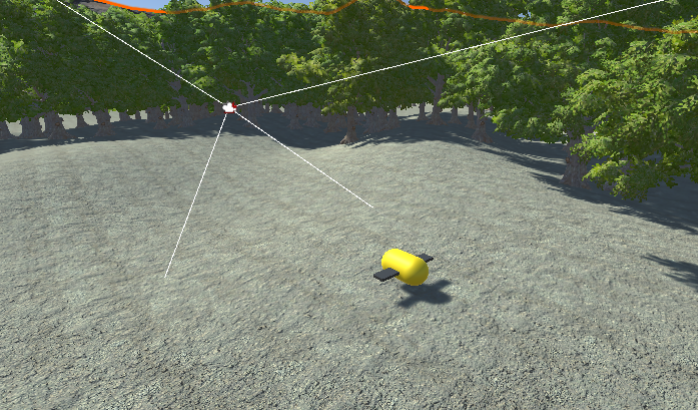

## Welcome to BeeHave
Have you ever dreamt of being as annoying as possible and ruining people's days? BeeHave is an open-world adventure game where the user plays as a Bee, pollinates flowers to collect different power-ups, or as we like to call them "flower-ups", to annoy humans.

## Team Members
- Micah Kim (ICS)
 

Micah created the player and flower interaction, implemented sounds throughout, and created the menu screen.
 
 
- Jiajun Kang (ICS)
 
Jiajun created and animated the bee and enemy models.
 
 
- James Lau (ICS)
 

James created the player and enemy interaction and the character movement.

## BeeHave Demo + Trailer
If you would like to view a demo of our game, click <a href="https://youtu.be/CchChjdPBxs">here</a>.
 
If you would like to view a trailer of our game, click <a href="https://youtu.be/KSSRVLUagFs">here</a>.

## Game Engine

The game is created entirely in Unity and Blender, and the user will use the WASD keys to control the bee. 

The bee (you) was created from scratch in Blender. The game have three unique animations for the Bee: flying, pollinating, and stinging. The terrain and the human are assets downloaded from the assets store, but the animation for the human is entirely unique. The human asset was downloaded, then imported into blender to bring to life. The animations featured for the human asset includes idle, slapping, stung, walking, swatting, fainitng, and getting scared. 

In-Game Shots:
 

 

 

Blender Shots:
 

 

Blender Animations:
 
(Flying)
 

 
(Pollinating)
 

 
(Stinging)
 

 
 
(Idle)
 

 
(Walking)
 

 
(Slapping)
 

 
(Swatting)
 

 
(Fainting)
 

 
(Scared)
 

## Current Game State
- Character movement finished
- Character model completed
- Landscape completed
- Basic funtionality of flower-ups created
- Pollinate and sting functionality finished
- Enemies created

## Future Updates
- Implement animations
- Point tracker
- New powerups

# 05/05/2021
This is our final log, and we have completed the core mechanics of our game, including player and enemy interaction, player and flower interaction, 3rd-person characater movement, implemented sounds throughout the game, and have created a menu screen.

# 04/07/2021
The blender model with the animation have been imported into Unity. Game wise, pollination is now possible with basic powerups. 
 

# 03/31/2021
The bee has a default animation where the wings flap and it hovers up and down. There are now basic terrain in the game environment.
 

# 03/24/2021
Basic movement has been set up with the game. Use WASD key to control the main character, and space bar to fly higher. Player is interactable with other objects, and there is a 3rd person camera that is set to point at the main character at all times.

# 03/17/2021
Basic modelling of the main character (a bee) has been made on Blender. Because this is the first time using blender, this may not have been the most efficient rig of the character model. The only bone structure in this model is in the wings, and the hair around the body is the native hair material provided by Blender. 
 

# 03/10/2021
Some concept art has begun to flow for our game. We now have some basic sketch of some silly bee powerups we could potentially add to the game. Development environment such as Github, Unity Collab, Discord group, and Trello board has been set up for easiler communication.
 

# 03/03/2021 
The game is in the brainstorm phase! We met up and decided we want a simple sandbox game where the sole objective is to mess around and ruin someone's day. This little determined bee will stop at nothing to ruin everything around him.
 

## View Miro <a href="https://miro.com/app/board/o9J_lSn7fj4=/">Here</a> 

## View Trello Board <a href="https://trello.com/b/Qbd5DfBi/bee-simulator">Here</a>

